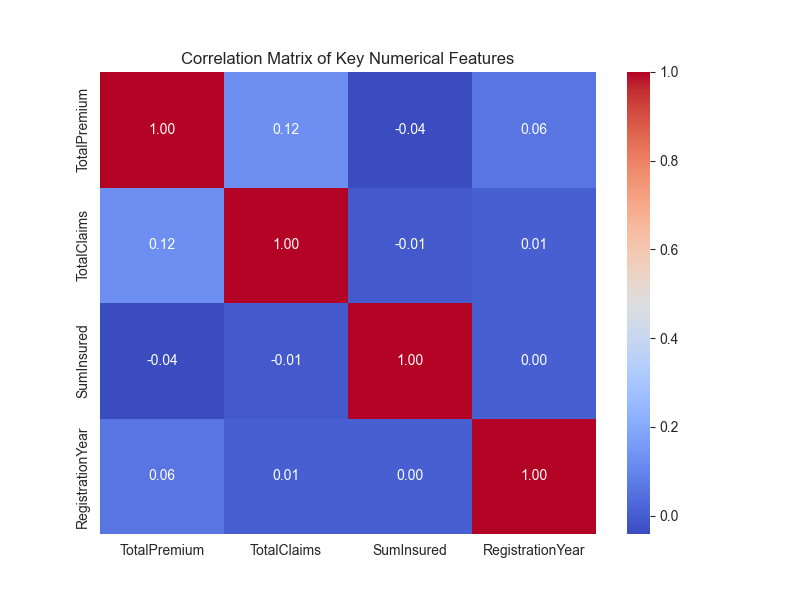
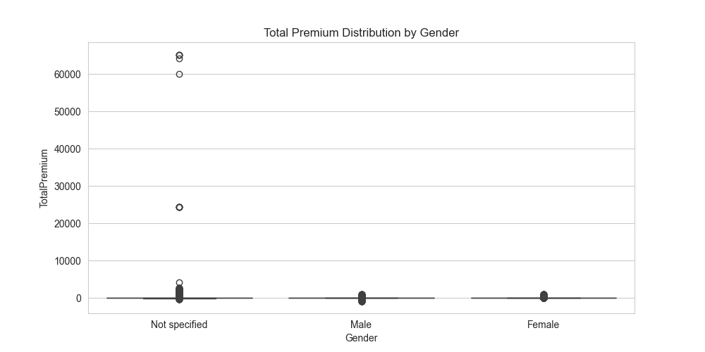

#  WK3-Insurance-Risk-Analytics: End-to-End Modeling Pipeline

This repository contains the complete machine learning pipeline for an insurance risk analytics project. The objective was to analyze claims data, validate key risk factors (territory and gender), and build a **baseline Logistic Regression model** to predict policy claim frequency.

---

##  Project Structure and Reproducibility (MLOps)

The project adheres to MLOps best practices, ensuring a clean and reproducible workflow, as detailed in the file structure below:

### 1. File Structure Validation

| File/Folder | Purpose | MLOps Principle |
| :--- | :--- | :--- |
| `.dvc` | DVC configuration files. | Data & Model Versioning |
| `.venv` | Python Virtual Environment | Environment Management |
| `data/` | Folder for all data. | Data Storage |
| **`data/MachineLearningRating_v3.txt.dvc`** | **DVC pointer file.** | **Data Version Control (DVC)** |
| `models/` | Folder for saving trained model artifacts (`.pkl` files). | Model Artifact Management |
| `visuals/` | Folder containing static plot images (`.png`). | Analysis Artifacts |
| `src/` | Folder for all executable Python source code. | Modular Code Design |
| `requirements.txt` | Lists all necessary Python packages. | Reproducibility |

### 2. Core Pipeline Scripts (`src/` directory)

| Script | Purpose | Task Phase |
| :--- | :--- | :--- |
| `src/1_eda.py` | **Exploratory Data Analysis** | Analysis |
| `src/2_hypothesis_test.py` | **Statistical Validation** | Analysis |
| `src/3_feature_engineering.py` | **Data Preparation** | Modeling Preprocessing |
| `src/4_model_training.py` | **Baseline Modeling** | Modeling & Evaluation |

---

##  Analytical Findings & Statistical Validation

### 1. Key Business Metrics (Loss Ratio)

The initial EDA confirmed significant imbalance in risk, with **Gauteng** showing the highest Loss Ratio (Claims / Premium) and **Northern Cape** the lowest.

| Segment | Loss Ratio (Claims/Premium) |
| :--- | :--- |
| **Gauteng (High Risk)** | 1.2220 |
| KwaZulu-Natal | 1.0827 |
| Western Cape | 1.0595 |
| *(...)* | *(...)* |
| **Northern Cape (Low Risk)** | 0.2827 |

### 2. Hypothesis Test Result

A **One-Sided Z-Test for Two Proportions** was conducted comparing the Claim Frequency of Gauteng ($\text{p}_1$) vs. Northern Cape ($\text{p}_2$).

* **Hypothesis:** $H_a: \text{p}_1 > \text{p}_2$ (Gauteng Claim Frequency is greater).
* **Result:** **Z-statistic = 2.8949**, **P-value = 0.0019**
* **Conclusion:** The **Null Hypothesis is Rejected**. The Claim Frequency in Gauteng is **statistically and significantly higher** than in Northern Cape, validating territory as a critical rating factor.

### 3. Visual Evidence

All key diagnostic plots are saved in the `visuals/` folder:

#### 3A. Risk Driver Correlation

The heatmap confirms the strongest linear relationship is between the financial metrics (Premium and Claims).

#### 3B. Premium Distribution and Outliers

Box plot showing the distribution of `TotalPremium` across different `Gender` categories.

---

##  Modeling and Evaluation

A baseline **Logistic Regression** model was trained using features engineered from the raw data, targeting the binary **Claim Frequency** variable.

### 1. Model Performance (Test Set)

| Metric | No Claim (Class 0) | Claim (Class 1) |
| :--- | :--- | :--- |
| **Precision** | 1.00 | **0.01** |
| **Recall** | 0.82 | **0.60** |
| **F1-Score (Claim)** | N/A | **0.03** |

### 2. Model Interpretation (Key Coefficients)

| Feature | Coefficient | Impact on Risk |
| :--- | :--- | :--- |
| **TotalPremium** | **+1.598** | Strongest positive predictor (Highest Risk). |
| **Gender_Male** | **+1.230** | Significantly increases the log-odds of a claim. |
| **Province_Western Cape** | -0.473 | Significant reduction in risk. |

**Conclusion:** The baseline model confirms that **Premium** and **Gender** are the dominant features. While Recall is adequate, the low Precision requires implementing advanced techniques (e.g., Tree-based models like XGBoost) in the next iteration.